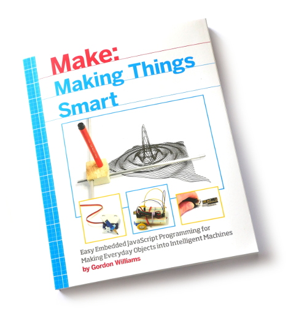

# Making Things Smart

Extra information for the ['Making Things Smart' book by Gordon Williams](http://shop.oreilly.com/product/0636920031246.do) (available from [O'Reilly](http://shop.oreilly.com/product/0636920031246.do) and [Amazon](https://www.amazon.co.uk/Making-Things-Smart-Programming-Transforming/dp/1680451898))

This code is designed for [Espruino JavaScript Microcontroller boards](http://www.espruino.com/Order)

## Code Examples

### Chapter 5

* [Experiment 4 Part 1](experiment4a.js)
* [Experiment 4 Part 2](experiment4b.js)
* [Experiment 5](experiment5.js)

### Chapter 6

* [Experiment 6](experiment6.js)
* [Experiment 7](experiment7.js)
* [Experiment 8](experiment8.js)

### Chapter 7

* [Experiment 9 Part 1](experiment9a.js)
* [Experiment 9 Part 2](experiment9b.js)
* [Experiment 9 Part 3](experiment9c.js)
* [Experiment 9 Part 4](experiment9d.js)
* [Experiment 10 Part 1](experiment10a.js)
* [Experiment 10 Part 2](experiment10b.js)

### Chapter 8

* [Experiment 11](experiment11.js)
* [Experiment 12](experiment12.js)
* [Experiment 13](experiment13.js)

### Chapter 9

* [Experiment 14 Part 1](experiment14a.js)
* [Experiment 14 Part 2](experiment14b.js)
* [Experiment 14 Part 3](experiment14c.js)
* [Experiment 14 Part 4](experiment14d.js)

### Chapter 10

* [Experiment 15](experiment15.js)

### Chapter 11

* [Experiment 16](experiment16.js)

### Chapter 13

* [Experiment 19 Part 1](experiment19a.html)
* [Experiment 19 Part 2](experiment19b.html)
* [Experiment 20](experiment20.html)
* [Experiment 21](experiment21.html)
* [Experiment 22](experiment22.html)

### Chapter 14

* [Experiment 25](experiment25.js)
* [Experiment 26](experiment26.html)

### Chapter 15

* [Experiment 28](experiment28.js)
* [Experiment 29](experiment29.js)
* [Experiment 30](experiment30.js)
* [Experiment 31](experiment31.js)
* [Experiment 32](experiment32.js)

### Chapter 16

* [Experiment 34 Espruino JavaScript](experiment34.js)
* [Experiment 34 HTML](experiment34.html)
* [Experiment 35](experiment35.js)
* [Experiment 36 Espruino JavaScript](experiment36.js)
* [Experiment 36 HTML](experiment36.html)

### Chapter 17

* [Experiment 38 Part 1](experiment38a.js)
* [Experiment 38 Part 2](experiment38b.js)
* [Experiment 38 Part 3 HTML](experiment38c.html)
* [Experiment 38 Part 4 HTML](experiment38d.html)
* [Experiment 38 Part 5](experiment38e.js)

### Chapter 18

* [Experiment 39 HTML Test page](experiment39.html)
* [Experiment 39 Part 1](experiment39a.js)
* [Experiment 39 Part 2](experiment39b.js)

## Purchasing Information

Where to find some of the component parts used in the book.

... to come soon.
